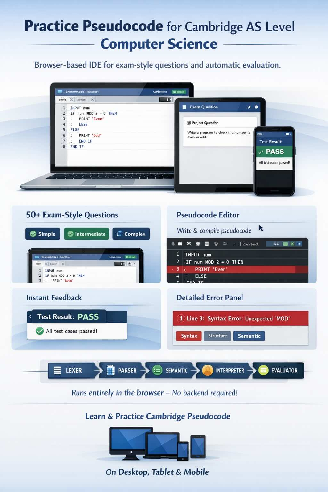

# Pseudocode IDE

[](https://github.com/nsriram/pseudo-code-ide/actions/workflows/ci.yml)
[](https://nsriram.github.io/pseudo-code-ide/)
[](https://pseudo-code-ide.onrender.com)
[](LICENSE)

A browser-based IDE for Cambridge AS Level Computer Science students to practise writing pseudocode for examination questions.

**[Try it live →](https://pseudo-code-ide.onrender.com)**



---

## Features

- **Exam-style question bank** — 50 questions across three difficulty levels (simple, intermediate, complex), modelled on real Cambridge AS exam papers with rich scenario context
- **Pseudocode editor** — plain text editor with line numbers and error gutter highlighting; no autocomplete so students practise unaided
- **Compiler pipeline** — full five-phase pipeline (lexer → parser → semantic validator → interpreter → evaluator) running entirely in the browser; no backend required
- **Auto-evaluation** — on a clean compile the program is executed against the question's test cases and a pass/fail result is shown instantly
- **Error panel** — structured error output with line/column references and source tags (Syntax, Structure, Semantic)
- **Keyboard shortcut** — Ctrl+Enter (or Cmd+Enter on Mac) compiles without lifting hands from the keyboard
- **Responsive layout** — works on desktop, tablet, and mobile (stacks vertically on small screens)

---

## Local Development

### Prerequisites

- [Node.js](https://nodejs.org/) 20 or later
- npm 10 or later

### Setup

```bash
git clone https://github.com/nsriram/pseudo-code-ide.git
cd pseudo-code-ide
npm install
```

### Run the dev server

```bash
npm run dev
```

Open [http://localhost:5173](http://localhost:5173) in your browser.

### Other scripts

| Command | Description |
|---|---|
| `npm run build` | Production build (output in `dist/`) |
| `npm run lint` | ESLint with security, accessibility, and code-quality plugins |
| `npm run lint:report` | ESLint JSON output → `eslint-report.json` |
| `npm run report:generate` | Convert `eslint-report.json` → HTML dashboard (`public/report/`) |
| `npm test` | Run unit tests (Vitest) |
| `npm run test:coverage` | Unit tests with coverage report |
| `npm run test:e2e` | End-to-end tests (Playwright) |
| `npm run generate:questions` | Regenerate `questions.json` from the script |

---

## Running with Docker

```bash
# Build
docker build -t pseudo-code-ide .

# Run (visit http://localhost:10000)
docker run -p 10000:10000 pseudo-code-ide
```

---

## Adding or Updating Questions

Questions are defined in [`scripts/generate-questions.ts`](scripts/generate-questions.ts) and compiled into [`src/features/questions/questions.json`](src/features/questions/questions.json).

**To add or edit questions:**

1. Open `scripts/generate-questions.ts`
2. Add or modify entries in the `questions` array — each entry follows this shape:

```typescript
{
  id: 'q051',                        // unique, sequential (q001–q050 are taken)
  difficulty: 'simple',              // 'simple' | 'intermediate' | 'complex'
  title: 'Short descriptive title',
  context: 'Multi-paragraph scenario describing the problem...',
  ask: 'The specific task the student must solve.',
}
```

3. Regenerate the JSON:

```bash
npm run generate:questions
```

4. Validate with the schema tests:

```bash
npm test -- scripts/generate-questions.test.ts
```

---

## Project Structure

```
pseudo-code-ide/
├── src/
│   ├── features/
│   │   ├── compiler/        # Lexer, parser, AST, validator, interpreter, runtime, evaluator
│   │   ├── editor/          # PseudocodeEditor component
│   │   ├── errors/          # ErrorPanel component
│   │   ├── evaluation/      # EvaluationPanel component (test case results)
│   │   └── questions/       # QuestionPanel, useQuestion hook, questions.json
│   ├── App.tsx
│   └── main.tsx
├── scripts/
│   ├── generate-questions.ts   # Question bank generator
│   └── generate-report.ts      # ESLint JSON → HTML quality dashboard
├── e2e/                         # Playwright end-to-end tests
│   ├── app.spec.ts              # Feature-level smoke tests
│   └── journeys.spec.ts         # Full user-journey scenarios
├── sample_questions/            # Reference Cambridge exam questions
├── .claude/                     # Claude Code config and pseudocode compilation rules
├── COMPILER_DESIGN.md           # Compiler theory reference (lexer through evaluator)
├── DESIGN.md                    # UI layout, component design, data model
├── Dockerfile
├── nginx.conf
└── render.yaml
```

---

## CI/CD Pipeline

GitHub Actions runs on every push and pull request to `main`:

```
push / PR
  │
  ├─ 1. Lint ──────────────────────────────── ESLint (security, a11y, sonarjs, react)
  │        │
  │        ├─ 2. Build ──────────────────────── tsc + vite build → uploads dist/ artifact
  │        ├─ 3. Test ───────────────────────── Vitest unit tests (515 tests)
  │        └─ 5. Quality Report (main only) ──── ESLint HTML dashboard → GitHub Pages
  │
  ├─ 4. E2E (needs: Build + Test) ──────────── Playwright against Docker container
  │
  └─ 6. Docker Image (main only, needs: E2E) ── build + push to ghcr.io
```

| Stage | Trigger | What it does |
|---|---|---|
| Lint | every push/PR | ESLint with react, jsx-a11y, security, no-unsanitized, sonarjs plugins |
| Build | after lint | TypeScript compile + Vite build; uploads `dist/` as artifact |
| Test | after lint | Vitest unit tests |
| E2E | after build+test | Playwright tests run against the production Docker image |
| Quality Report | `main` push | Generates HTML quality dashboard, deploys to [GitHub Pages](https://nsriram.github.io/pseudo-code-ide/) |
| Docker Image | `main` push | Builds multi-stage Docker image and pushes to `ghcr.io` |

All actions run on Node.js 24 native runners (no deprecation warnings).

## Deployment

The app is deployed on [Render](https://render.com) as a Docker web service.

- **Hosting**: Render pulls the Docker image from `ghcr.io` and serves it via nginx on the free tier.
- **Config**: `render.yaml` defines the service; `nginx.conf` handles SPA routing and cache headers.
- **Quality report**: Published automatically on every `main` push at [nsriram.github.io/pseudo-code-ide](https://nsriram.github.io/pseudo-code-ide/).

---

## Contributing

See [CONTRIBUTING.md](CONTRIBUTING.md).

## Design

See [DESIGN.md](DESIGN.md) for UI layout, component design, and compiler architecture overview.  
See [COMPILER_DESIGN.md](COMPILER_DESIGN.md) for a full compiler-theory walkthrough of every phase (lexer, parser, validator, interpreter, evaluator).

## License

[MIT](LICENSE)